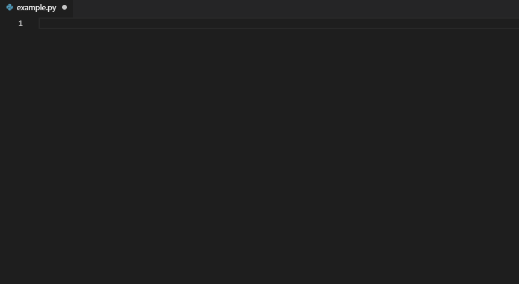

# Fastai Code Snippets for VSCode

[](https://marketplace.visualstudio.com/items?itemName=SBSnippets.fastai-snippets)
[](https://marketplace.visualstudio.com/items?itemName=SBSnippets.fastai-snippets)
[](https://marketplace.visualstudio.com/items?itemName=SBSnippets.fastai-snippets)
[](LICENSE.md)
[](https://github.com/SvenBecker/vscode-pytorch/releases)

This project aims to provide a faster workflow when using the [fastai](https://github.com/fastai/fastai) library in [Visual Studio Code](https://code.visualstudio.com/).
This extension provides code snippets for often used coding blocks as well as code example provided by the official fastai docs for common deep learning tasks.

## Table of Contents

1. [Getting Started](#usage)
2. [Dependencies](#dependencies)
3. [Installation](#installation)
4. [Changelog](#changelog)
5. [Get Involved](#involved)
    1. [Contributing](#contributing)
    2. [Future Plans](#plans)
    3. [Contact](#contact)
6. [Credits](#credits)

## <a name="usage" > </a> Getting Started

If this extension is installed and activated you might notice by start typing `pytorch` or `fastai` in your python file a dropdown list appears. Entries starting with `pytorch:` or `fastai:` represent code snippets refering to those libraries offered by this extension.
Snippets appear in the same way as code completion by using `Ctrl+Space`. There are _placeholders_, _variables_ and _choices_ defined inside the code snippets so you can jump from one to another just by pressing `Tab`. Examples on how to use this extension are shown below. For a full overview please take a look at the [Snippet Collection](COLLECTIONS.md).



## <a name="dependencies" > </a> Dependencies

Currently the snippets are working for the latest releases of the supported libraries:

* fastai >= 1.0.55

>__Note__:
>Be aware that at the time the fastai library is changing rapidly and currently this project is work in progress.
>I will try to keep the snippets in line with the latest fastai library developments, so it might not work for you in case you are using an _outdated_ version.
>There might be some functionality which doesn't work yet. I will try to fix it as soon as possible. Furthermore it would be appreciated to inform me about bugs or any other issues.

## <a name="installation" > </a> Installation

The installation process is very straightforward. The recommend, stable way is as follows:

1. Launch Visual Studio Code
2. From the command palette `Ctrl-Shift-P` (Windows, Linux) or `Cmd-Shift-P` (MacOS) select `Install Extension` or just simply go to the `Extensions` tab (most likely the fifth entry on the left sidebar). You can also use the hotkey `Ctrl-Shift-X` respectifely `Cmd-Shift-X`
3. Type `Fastai Snippets`
4. Choose and install extension
5. Restart/Reload Visual Studio Code

This will give you the most recent version you can find on the [VS Marketplace](https://marketplace.visualstudio.com/vscode).
Alternatively you can also clone this repository and move it manually into your VS Code extension folder which will give you
the most recent version on GitHub.

```sh
git clone https://github.com/SvenBecker/vscode-fastai.git
mv vscode-pytorch /path/to/your/VSCodeExtensionFolder/
```

On Windows for example you can normally find the extension folder at `C:\Users\YourName\.vscode\extensions`. On MacOS and Linux it should be located at `~/.vscode/extensions`.

> __Note__: The second method will give you the overall most recent version because I won't update the VS Marketplace version as often
> as the GitHub version but the VS Marketplace version will probably be the more stable one.

## <a name="changelog" > </a> Changelog

#### Version 0.1.0:

##### Added

- First release

## <a name="involved" > </a> Get Involved

### <a name="contributing" > </a> Contributing

If you want to contribute, what I would highly appreciate since this project is currently in a very early stage
and there is still so much to do, please take a look at [Contributing](CONTRIBUTING.md).

### <a name="plans" > </a> Future Plans

I'm still trying to get all the new updates. Have been quit busy so I didn't paid much attention to the fastai library changes.

### <a name="contact" > </a> Contact

Suggestions for improvements will be highly appreciated. You can write me an email (address is provided on my [profile](https://github.com/SvenBecker)) or you can contact me via Twitter [@SBX9209](https://twitter.com/SBX9209).

## <a name="credits" > </a> Credits

* [Fastai](https://www.fast.ai/): Also a huge thanks to Jeremy Howard and the whole fast.ai team for creating this great deep learning library and also for offering wonderful, very practical orientated free lectures giving insight to deep learning to a wide range of people including ml/dl beginners as well as advanced practitioners.
* [VSCode](https://code.visualstudio.com/): My personal favorite text editor and I'm grateful for all the options they are offering, like a huge amount of language support, extensions, integrated terminal, debugger etc..
